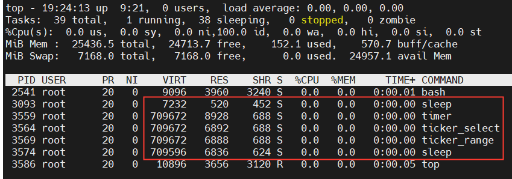
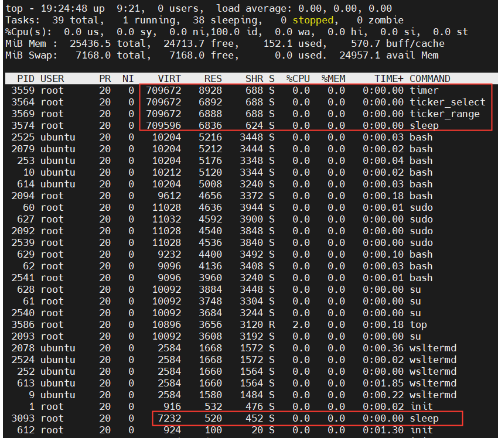

# GoSleepTimerTicker
Compare the performance of time.Sleep, time.Ticker, time.Timer

I set the time interval of the periodic task as _15 Minutes_, because I want to compare the performance while ***sleeping***, not ***executing***. 

I compare:
- sleepprogram/sleep.go
- tickerrangeprogram/ticker_range.go
- tickerselectprogram/ticker_select.go
- timerprogram/timer.go
- Shell sleep

### Result:

Linux `top` command sorted by **CPU**:
>almost no difference, all 0, including _Shell_ `sleep` (pid 3093)\
all lower than _Shell_ `sleep` (pid 3093)\

Linux `top` command sorted by **Memory**:
>almost no difference, all 0, including _Shell_ `sleep` (pid 3093)\
all higher than _Shell_ `sleep` (pid 3093)\

